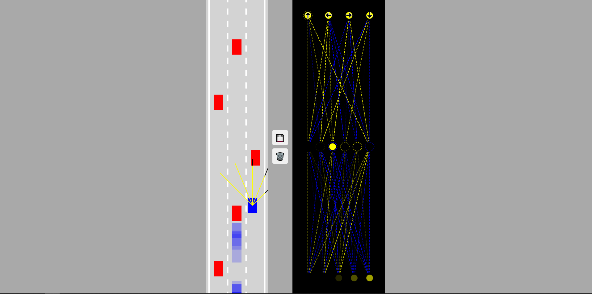
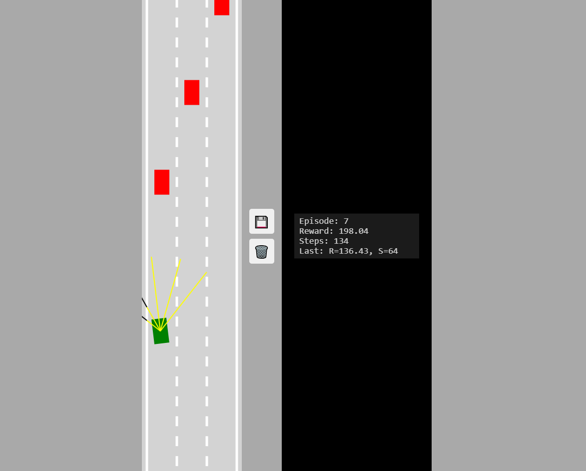

# Self-Driving Car Simulation


 
## Overview

This project is a self-driving car simulation built using HTML, CSS, and JavaScript. It demonstrates basic concepts of physics, controls, neural networks, reinforcement learning, and rendering in a 2D space. The simulation includes AI-driven cars that learn to navigate a road with traffic.

## Features

- **AI-Driven Cars**: Simulates multiple cars controlled by neural networks.
- **Reinforcement Learning Agent**: Includes a car controlled by a Q-learning RL agent that learns to drive through trial and error, with its progress saved automatically.
- **Traffic Simulation**: Includes dummy cars to simulate real-world traffic.
- **Neural Network Visualization**: Visualizes the neural network's structure and activity.
- **Car Movement**: Cars can accelerate, decelerate, and turn left or right.
- **Road with Lanes**: A road with multiple lanes, lane markings, and borders.
- **Physics Simulation**: Implements acceleration, friction, and speed limits.
- **Canvas Rendering**: Renders the simulation on HTML canvas elements.

## Reinforcement Learning Implementation


- The RL agent uses a Q-learning algorithm (tabular, pure JavaScript) to learn optimal driving actions based on sensor readings and speed.
- The agent receives positive rewards for moving forward, negative rewards for crashes, and small penalties for inactivity.
- The Q-table is automatically saved to the browser's localStorage every 50 steps and after each crash, so learning progress is preserved across reloads.
- You can export the Q-table as a JSON file for backup or sharing.
- The RL car is visualized in green, and its average reward is displayed on the simulation canvas.

## File Structure

```
self-driving-car/
├── public/
│   └── index.html       # Main HTML file
├── src/
│   ├── css/
│   │   └── style.css    # Styling for the simulation
│   ├── js/
│   │   ├── car.js         # Car class implementation
│   │   ├── controls.js    # Keyboard controls for the car
│   │   ├── main.js        # Main script to initialize and animate the simulation
│   │   ├── network.js     # Neural network implementation
│   │   ├── road.js        # Road class with lane management
│   │   ├── sensor.js      # Implements the sensor class for detecting obstacles
│   │   ├── utils.js       # Utility functions (e.g., linear interpolation)
│   │   ├── rl_agent.js    # Reinforcement learning agent (Q-learning)
│   │   ├── utils_rl.js    # Reinforcement learning utility functions
│   │   └── visualizer.js  # Neural network visualization
├── images/
│   ├── self-driving-car.png
│   └── rl-car.png
└── README.md              # Project documentation
```

## How to Run

1. Clone the repository:
   ```bash
   git clone <repository-url>
   ```
2. Open the `public/index.html` file in a web browser.
   - Note: If the project uses `fetch` or other features requiring a server, use a local server (e.g., `Live Server` in VS Code).

## Controls

- **Arrow Up**: Move forward
- **Arrow Down**: Move backward
- **Arrow Left**: Turn left
- **Arrow Right**: Turn right
- Note: The default control type is "AI" for autonomous driving.

## Classes and Methods

### Car

- **Properties**:
  - `x`, `y`: Position of the car.
  - `width`, `height`: Dimensions of the car.
  - `controls`: Instance of the `Controls` class.
  - `sensor`: Instance of the `Sensor` class (optional).
  - `brain`: Neural network controlling the car.
- **Methods**:
  - `update()`: Updates the car's position, speed, and collision status.
  - `draw(ctx)`: Draws the car on the canvas.

### Controls

- **Properties**:
  - `forward`, `left`, `right`, `reverse`: Boolean flags for keyboard inputs.
- **Methods**:
  - `#addKeyboardListeners()`: Adds event listeners for keyboard inputs.

### Road

- **Properties**:
  - `x`, `width`, `laneCount`: Dimensions and lane configuration.
  - `borders`: Array of road borders.
- **Methods**:
  - `getLaneCenter(laneIndex)`: Calculates the center of a specific lane.
  - `draw(ctx)`: Draws the road and its lane markings.

### NeuralNetwork

- **Properties**:
  - `levels`: Array of levels representing the layers of the neural network.
- **Methods**:
  - `feedForward(inputs)`: Processes inputs through the network.
  - `mutate(amount)`: Applies random changes to the network's weights and biases.

### Visualizer

- **Methods**:
  - `drawNetwork(ctx, network)`: Visualizes the neural network on a canvas.

### Utils

- **lerp(A, B, t)**: Linear interpolation between two values.
- **getIntersection(A, B, C, D)**: Calculates the intersection point of two line segments.
- **polysIntersect(poly1, poly2)**: Checks if two polygons intersect.
- **getRGBA(value)**: Converts a numerical value to an RGBA color string.

### Sensor

- **Purpose**: Used for detecting obstacles and road boundaries.
- **Properties**:
  - `car`: The car that the sensor is attached to.
  - `rayCount`: Number of rays cast by the sensor.
  - `rayLength`: Length of each ray.
  - `raySpread`: Angle spread of the rays.
  - `rays`: Array of rays, each represented by two points (start and end).
  - `readings`: Array of readings from the rays, representing intersections with road borders or traffic.
- **Methods**:
  - `update(roadBorders, traffic)`: Updates the rays and readings based on the car's position and angle.
  - `draw(ctx)`: Draws the rays and their intersections on the canvas.

## License

This project is licensed under the MIT License. See the [LICENSE](LICENSE) file for details.
